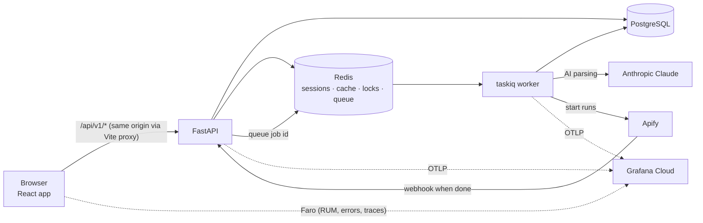
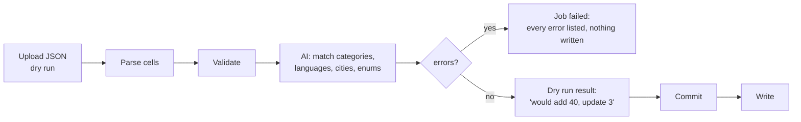

# Ripple Pulse

Ripple Links' internal database of creators, brands, pitches and campaigns. Ripple Pulse lets the team:

- Search the whole database from one place.
- Open any record and edit it, with locking so two people can't overwrite each other.
- Upload sheet exports through an AI-assisted ingest pipeline.
- Keep Instagram stats fresh through Apify.
- Watch data quality on an analytics dashboard.

The repo has two apps:

| Folder | What | Stack |
|---|---|---|
| [`backend/`](backend) | REST API plus a background worker | Python 3.14, FastAPI, SQLModel, PostgreSQL, Redis, taskiq, LangChain + Claude, OpenTelemetry |
| [`frontend/`](frontend) | The web app | React 19, TypeScript, Vite 6, TanStack Query, Tailwind 4, rsuite, Grafana Faro |

---

## How it fits together



- **The API never does slow work itself.** Uploads and Apify results are stored as a job row in Postgres, and only the job id goes onto the Redis queue. The worker picks it up, so a worker restart never loses a job: a sweep every 10 minutes re-queues anything stuck.
- **Sessions are cookies.** The session cookie is `httpOnly`, and the CSRF token works by double-submit: an `X-CSRF-Token` header on every write. In development the frontend calls `/api/v1/...` on its own origin and Vite proxies it to the backend, so the cookies just work.
- **One trace per action.** A click in the browser, the API request it makes, and the worker job it starts all share one trace id in Grafana.

---

## Repository layout

```
backend/
  app/
    api/v1/        routes: auth, search, detail, edits, users, ingest, apify, taxonomy, analytics, admin, health
    core/          settings (config.py), db, redis, cache, security, email
    models/        SQLModel tables; versioned.py adds the edit "version" column
    schemas/       request / response shapes
    services/      the logic: search, edits + locks, users, ingest/ (AI pipeline), apify/, ai.py, analytics
    observability/ OpenTelemetry setup, metrics, Grafana alert rules
    migrations/    Alembic
    main.py        API entry point
    worker.py      taskiq worker + scheduled tasks
  .env.example
  pyproject.toml
frontend/
  src/
    pages/         one folder per screen (search, detail, analytics, ingest, taxonomy, auth)
    features/      screen logic: search tables + drawers, analytics, ingest, auth, header
    lib/           api-client, endpoints, query client, observability (Faro)
    types/api.ts   API types
  vite.config.ts   dev server (port 5173) + /api proxy
  .env.example
docs/
  ingest-json-formats.md
```

---

## Prerequisites

| Tool | Version | Notes |
|---|---|---|
| Python | 3.14 | Use [uv](https://docs.astral.sh/uv/) (recommended) or pip |
| Node.js | 20+ | npm comes with it |
| PostgreSQL | 18 (16+ works with one extra step) | needs the `pg_trgm` extension |
| Redis | 7+ | Docker is the easy way on Windows |
| Docker Desktop | any | optional; runs Redis, and the local Grafana stack |

---

## Getting started (local)

Commands are for PowerShell on Windows; they're the same on macOS/Linux apart from the activate line.

### 1. Database and Redis

```powershell
docker run -d --name redis -p 6379:6379 redis:7
```

Create the database in `psql` (or pgAdmin), then enable the two things the migrations rely on:

```sql
CREATE DATABASE "RL_DB_DEV";
\c "RL_DB_DEV"

-- PostgreSQL 16/17 only (18 has uuidv4() built in):
CREATE FUNCTION uuidv4() RETURNS uuid LANGUAGE sql AS 'SELECT gen_random_uuid()';
```

### 2. Backend

```powershell
cd backend
uv sync                       # creates .venv and installs everything in pyproject.toml
.venv\Scripts\activate        # macOS/Linux: source .venv/bin/activate
copy .env.example .env        # then fill it in: see "Configuration" below
alembic upgrade head          # enable pg_trgm extension and creates all tables
```

Run the API and the worker in two terminals:

```powershell
uvicorn app.main:app --reload --port 8000
```
```powershell
taskiq worker app.worker:broker --workers 2
```

Optionally, run a third process for the scheduled jobs: the nightly Instagram refresh and the 10-minute stuck-job sweep.

```powershell
taskiq scheduler app.worker:scheduler
```

Run exactly **one** scheduler, however many workers you run.

Check it's up: http://localhost:8000/api/v1/health/postgresdb and `/health/redis`. The interactive API docs are at http://localhost:8000/api/v1/docs.

### 3. Frontend

```powershell
cd frontend
npm install
copy .env.example .env.local
npm run dev                   # http://localhost:5173
```

Vite forwards every `/api` request to `VITE_PROXY_TARGET` (the backend), so the browser only ever talks to one origin.

### 4. Your first user

1. Sign up at http://localhost:5173/signup with an `@ripplelinks.com` address. The verification email needs the SMTP settings; without them, set `is_verified` by hand as below.
2. Make yourself super admin; from then on you can give everyone else their permissions from the app:

```sql
UPDATE "user"
SET is_verified = true, is_superadmin = true, is_admin = true, can_edit = true, can_ingest = true
WHERE email = 'you@ripplelinks.com';
```

---

## Configuration

### Backend: `backend/.env`

Settings live in `app/core/config.py`; anything not in `.env` uses the default there. The settings with no default (marked **required**) must exist for the app to start. For local work, a placeholder is fine for any integration you aren't using.

| Group | Setting | What it's for |
|---|---|---|
| App | `ENVIRONMENT` | `DEV` or `PROD`. `PROD` makes cookies `Secure`, and it is the label on all telemetry. |
| | `FRONTEND_URL` | Where email links and the Google sign-in redirect point. Locally `http://localhost:5173/` (keep the trailing `/`). |
| | `BACKEND_CORS_ORIGINS` | Comma-separated origins allowed to call the API directly. Not needed while you go through the Vite proxy. |
| | `ALLOWED_DOMAINS` | Email domains allowed to sign up (`ripplelinks.com`). |
| | `PUBLIC_API_URL` **required** | The backend's public address. Apify calls `{PUBLIC_API_URL}/api/v1/apify/webhook` when a run finishes, so locally use a tunnel (ngrok) if you want Apify to work. |
| Database | `DB_HOST` `DB_PORT` `DB_USERNAME` `DB_PASSWORD` `DB_NAME` | PostgreSQL connection. |
| Redis | `REDIS_HOST` `REDIS_PORT` `REDIS_PATH` | Redis connection (`REDIS_PATH` is the db number). |
| Google sign-in | `GOOGLE_CLIENT_ID` `GOOGLE_CLIENT_SECRET` `GOOGLE_REDIRECT_URI` **required** | OAuth client from Google Cloud. The redirect URI is `http://localhost:5173/api/v1/auth/google/callback` locally. Google rejects private IPs like `192.168.x.x`. |
| Email | `SMTP_PASSWORD` `RL_LOGO_CDN_URL` **required**, plus `SMTP_*` | Verification and password-reset emails (Gmail app password). |
| AI parser | `AI_API_KEY` **required**, `AI_MODEL`, `AI_BATCH_SIZE`, `AI_CONCURRENCY` | Anthropic key for the ingest pipeline (default model `claude-haiku-4-5`). |
| Apify | `APIFY_API_TOKEN` `APIFY_WEBHOOK_SECRET` **required**, `APIFY_REFRESH_AFTER_DAYS`, `APIFY_REFRESH_BATCH` | Instagram profile refreshes. The secret is any long random string; Apify sends it back on the webhook. |
| Apps Script | `APPS_SCRIPT_API_URL` `APPS_SCRIPT_API_SECRET` **required** | The Google Apps Script web app. |
| Telemetry | `OTEL_ENABLED`, `OTEL_EXPORTER_OTLP_ENDPOINT`, `OTEL_EXPORTER_OTLP_HEADERS` | Where traces, metrics and logs go. See [Observability](#observability). |
| Alerts | `GRAFANA_URL`, `GRAFANA_TOKEN`, `ALERT_EMAILS` | Used by the alerts setup script. |
| Search | `MAX_PAGE_SIZE`, `BRAND_DETAIL_LIMIT`, `TOP_CREATORS_LIMIT` | Result limits. |

### Frontend: `frontend/.env.local`

| Setting | Example | What it's for |
|---|---|---|
| `VITE_API_BASE_URL` | `/api/v1` | Keep it relative in development, so requests go through the proxy and stay same-origin (cookies depend on this). |
| `VITE_PROXY_TARGET` | `http://localhost:8000` | Where Vite forwards `/api`. |
| `VITE_FARO_ENABLED` | `true` | Must be exactly `true` to turn on browser telemetry. |
| `VITE_FARO_COLLECTOR_URL` | `https://faro-collector-…grafana.net/collect/…` | From Grafana Cloud. See [Observability](#observability). |
| `VITE_APP_ENVIRONMENT` | `dev` | Label on frontend telemetry; match the backend's. |
| `VITE_APP_VERSION` | `0.1.0` | Shown on frontend telemetry. |

Vite reads `.env.local` only when it starts, so restart `npm run dev` after changing it.

---

## What's in the app

| Screen | What it does | Who |
|---|---|---|
| **Search** (`/search`) | Home cards, plus one box that searches all four sections at once and suggests as you type. Paste a profile link to jump straight to that creator. | everyone |
| **Creators** / **Brands** | Filterable, sortable tables (followers, tier, category, language, city, contacts, package cost, campaign history, …). A row opens a side drawer with the full record. | everyone |
| **Campaigns** / **Pitches** | Tables plus full detail pages with every creator row and its costs and results. | everyone |
| **Analytics → Creators** | Data-quality dashboard: what's missing where, by platform, category and language. Fix records in place. | everyone; editing needs `can_edit` |
| **Ingest** (`/ingest`) | Upload a sheet export (JSON) and see every error before anything is written. | `can_ingest` |
| **Taxonomy** (`/taxonomy`) | The category and language lists that uploads are matched against. | `can_ingest` |

### Permissions

| Flag | Grants |
|---|---|
| (signed in) | Read everything, including each record's edit history |
| `can_edit` | Edit, delete, and add creators to pitches and campaigns |
| `can_ingest` | Uploads, taxonomy, Apify runs |
| `is_admin` | Manage users (upload/edit rights, switch people off), clear stuck edit locks, see all recent edits |
| `is_superadmin` | Everything above, plus grant admin rights and change alert recipients |

Switching someone off (`is_currently_employed = false`) signs them out everywhere at once and blocks sign-in. No one can remove their own admin rights or switch themselves off, so there is always an active super admin.

---

## How the main pieces work

### Ingest: sheet export → database



- **Sources:** `pitch_master`, `campaign_master`, `pitch_creator`, `campaign_creator`, and `creator` (direct creator list).
- **Every problem is an error, and one error stops the whole file.** There are no warnings and no partial writes.
- **A dry run writes nothing.** Committing it reuses the dry run's AI answers, so you aren't charged for the AI twice and the result is exactly what you reviewed.
- **The AI only maps messy cells onto values that already exist** (taxonomy terms, enums, Indian cities and states). It can't invent a category; an unknown one is an error that tells you to add it under Taxonomy.

The file formats are in [`docs/ingest-json-formats.md`](docs/ingest-json-formats.md).

### Instagram refresh (Apify)

- **Nightly run:** at 03:00 IST the scheduler starts an Apify run for active Instagram creators not refreshed in `APIFY_REFRESH_AFTER_DAYS`, up to `APIFY_REFRESH_BATCH` at a time.
- **Results:** Apify calls the webhook when the run finishes, and the worker updates followers, average views, tier, bio and contacts. It fills missing city and category from the bio.
- **Missed webhooks:** if a webhook never arrives, the 10-minute sweep checks the run with Apify directly.

### Editing, locks and history

- **Opening an edit form reserves the record** for 2 minutes, and the form renews the reservation every minute. Anyone else who tries to edit sees "Priya is editing this creator".
- **Every editable row has a version number.** A save is refused (409) if the row changed since the form opened, including changes made by an upload or an Apify refresh. Nothing is overwritten silently.
- **Every save is recorded in `edit_log`:** who, when, and each field's old and new value. A delete keeps a full copy of the row. Admins see everything at `GET /api/v1/edits`.
- **Deletes are refused while something still uses the record.** For example, a creator who is on a campaign can only be marked inactive. Inactive creators are hidden from search by default.

---

## Observability

The backend sends traces, metrics and logs over OpenTelemetry (OTLP). The frontend sends browser sessions, errors, Web Vitals and traces with Grafana Faro. Both go to the same Grafana stack, and a browser action's trace continues into the API and the worker.

**Local**: one container with Grafana, Tempo, Loki and Prometheus:

```powershell
docker run -d --name lgtm -p 3000:3000 -p 4318:4318 grafana/otel-lgtm
```

In `backend/.env`, set `OTEL_ENABLED=true` and leave `OTEL_EXPORTER_OTLP_ENDPOINT=http://localhost:4318`. Grafana is at http://localhost:3000 (admin / admin).

**Grafana Cloud**:

1. **Backend data:** your stack → **OpenTelemetry → Configure** → generate a token. Copy the endpoint (ending in `/otlp`) into `OTEL_EXPORTER_OTLP_ENDPOINT`, and `Authorization=Basic%20…` into `OTEL_EXPORTER_OTLP_HEADERS`.
2. **Browser data:** in Grafana, **Frontend → Frontend Apps → Create new**. Add your frontend's host under **CORS Allowed Origin**, then copy the collector `url` into `VITE_FARO_COLLECTOR_URL`.
3. **Alerts:**
   1. Create a service account with the **Editor** role (**Administration → Users and access → Service accounts**) and put its token in `GRAFANA_TOKEN`.
   2. Set `GRAFANA_URL=https://<stack>.grafana.net`.
   3. Run:

```powershell
python -m app.observability.alerts
```

This creates five email alerts:
- ingest job failed
- Apify run failed
- Apify webhook overdue
- worker not reporting
- API returning 5xx errors

Super admins can change the recipients later from `PUT /api/v1/admin/alerts` without a deploy.

What to look at:

| Where | Query |
|---|---|
| Explore → Tempo | service `ripple-pulse-api`, `ripple-pulse-worker` or `ripple-pulse-web` |
| Explore → Loki | `{service_name="ripple-pulse-worker"}` |
| Explore → Prometheus | `pulse_ingest_jobs_total`, `pulse_apify_runs_total`, `pulse_worker_up`, `pulse_api_errors_total` |

**Privacy:**
- **Backend:** telemetry carries ids, counts and timings only, never sheet cells, contacts or AI prompts.
- **Frontend:** `lib/observability/privacy.ts` strips query strings, emails and tokens before anything leaves the browser, and console capture is off.

---

## Everyday commands

| Where | Command | Does |
|---|---|---|
| backend | `uvicorn app.main:app --reload --port 8000` | API with auto-reload |
| backend | `taskiq worker app.worker:broker --workers 2` | background worker |
| backend | `taskiq scheduler app.worker:scheduler` | scheduled jobs (run one) |
| backend | `alembic upgrade head` | apply migrations |
| backend | `alembic revision --autogenerate -m "what changed"` | new migration after a model change; **read it before applying** |
| backend | `alembic check` | confirms models and database agree |
| backend | `python -m app.observability.alerts` | create or update the Grafana alerts |
| frontend | `npm run dev` | dev server on :5173 |
| frontend | `npm run build` | typecheck + production build to `dist/` |
| frontend | `npm run typecheck` / `npm run lint` | checks only |

### Changing the database

1. Edit the model in `backend/app/models/`.
2. Run `alembic revision --autogenerate -m "..."` and **read the generated file**. Autogenerate compares against *your* database, so if yours is behind, it writes catch-up steps that break everyone else's.
3. Run `alembic upgrade head` and then `alembic check`. Try `alembic downgrade -1` and `upgrade head` again before you commit.

---

## Deploying

- **Production settings:** set `ENVIRONMENT=PROD`. This makes cookies `Secure`, so the site must be served over HTTPS.
- **Serve both apps from one domain:** the built frontend (`npm run build` → `frontend/dist/`) and the API under `/api/v1`, behind one reverse proxy. The cookies are `SameSite=Lax` and depend on that.
- **Processes:** run the API, at least one worker, and **exactly one** scheduler.
- **Public URL:** `PUBLIC_API_URL` must be reachable from the internet, or Apify webhooks never arrive.
- **Migrations:** run `alembic upgrade head` before starting the new API version.
- **Alerts:** point telemetry at Grafana Cloud and run the alerts script once per environment. Each environment's rules only look at their own data.

---

## Troubleshooting

| Symptom | Likely cause |
|---|---|
| Sign-in "works" but every request returns 401/403 | The frontend and API are on different sites (e.g. `localhost` vs `192.168.x.x`), so the cookies aren't sent. Use the Vite proxy, or open the app on the same host as the API. |
| `relation "…" already exists` on `alembic upgrade` | A migration was autogenerated against a database that was behind. Remove the catch-up steps from that file. |
| Uploads stay `queued` | The worker isn't running, or it's using a different Redis. |
| Apify runs never finish | `PUBLIC_API_URL` isn't reachable from the internet. The 10-minute sweep will still pick results up, as long as the scheduler is running. |
| No telemetry in Grafana | Check the console log for OTLP export errors: 401 means a bad header, 404 means the endpoint is missing `/otlp`. |
| Faro sends nothing from the browser | `VITE_FARO_ENABLED` isn't exactly `true`, the collector URL is still the dummy one, or Vite wasn't restarted after editing `.env.local`. |
| "Worker not reporting" email every evening | Expected while you stop the worker at night in DEV. Pause that rule in Grafana while developing. |

---

## Known gaps

- **Feedback dialog:** it posts to `/feedback`, which the backend doesn't have yet.
- **Apps Script panel on Ingest:** it calls `/ingest/apps-script/{source}`, which was removed when ingest moved to uploads. It needs removing or rewiring.
- **Committing a dry run:** the Ingest page doesn't call `POST /ingest/jobs/{id}/commit` yet.
- **Analytics:** the Brands, Campaigns and Pitches sections are placeholders ("Coming soon").
- **`docs/ingest-json-formats.md`:** it predates the current pipeline. It refers to files that no longer exist, and its source list leaves out `creator`.